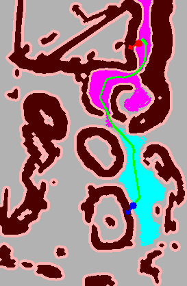
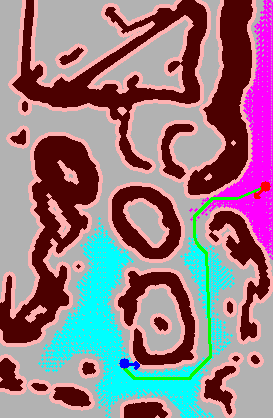

# BMHS Path Planner

BMHS (Bidirectional Multi-Heuristic Search) is a hybrid A* path planner designed for ground vehicles. It features kinematic-aware planning for both Ackermann (car-like) and Differential drive models, with optimized C++ heuristics for rapid convergence.

## Features
- **Vehicle Kinematics**: Supports `ackermann` and `differential` vehicle types.
- **Fast Heuristics**: C++ implementation (via pybind11) for computing 2D Dijkstra heuristics rapidly, achieving 100x+ speedup over native Python.
- **Clearance-Aware Simplification**: Post-processes the A* path using line-of-sight checks that respect obstacle clearance to eliminate unnecessary zigzags.
- **Smooth Trajectories**: Bezier curve smoothing for Ackermann vehicles, ensuring physical drivability.

## Visual Examples

Here are examples showing the kinematic-aware path planning, simplification, and smoothing in action.

### Ackermann (Car-like) Planning

*Ackermann mode featuring bezier curve smoothing at corners, honoring the minimum turning radius.*

### Differential Drive Planning

*Differential mode featuring long straight line-of-sight paths and in-place pivoting capabilities.*

## Installation

### Dependencies
Install the required Python packages:
```bash
pip install -r requirements.txt
```

### Build C++ Core
To take advantage of the fast heuristic calculation, build the C++ extension:
```bash
cd bmhs_cpp
pip install -e .
```

## Usage

### Fast Planner (C++ Accelerated)
```bash
cd bmhs_cpp
python bmhs_planner_fast.py --map ../map.pgm --vtype ackermann --auto
```

### Pure Python Planner
```bash
python bmhs_planner.py --map map.pgm --vtype differential --auto
```

### Arguments
- `--map`: Path to the PGM map file.
- `--res`: Map resolution in meters/pixel (default: 0.05).
- `--vtype`: Vehicle kinematics type (`ackermann` or `differential`).
- `--width`: Vehicle width in meters (default: 1.0).
- `--length`: Vehicle length in meters (default: 1.0).
- `--inflation`: Obstacle inflation radius in meters (default: 0.2).
- `--auto`: Auto-generate random start and goal configurations.
- `--start`: Specify start state `x y theta`.
- `--goal`: Specify goal state `x y theta`.
- `--save`: Save the planned path visualization to an image file.
