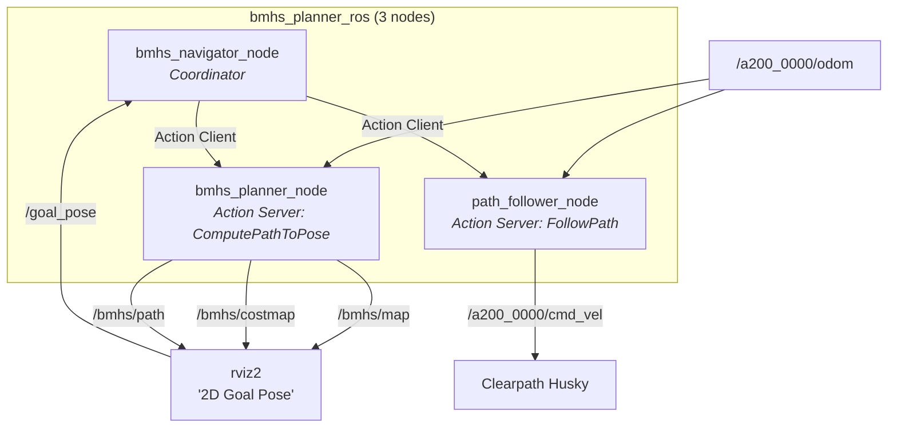

# BMHS ROS2 C++ Package (`bmhs_planner_ros`)

This package provides a native **ROS2 Humble C++** implementation of the BMHS (Bidirectional Multi-Heuristic Search) path planner. Designed with a professional action-based architecture, it ports the core BMHS algorithm logic into zero-dependency C++17, ensuring compatibility with the `nav2` ecosystem.

## Architecture

The system operates across three primary nodes communicating via ROS2 actions:



### 1. `bmhs_planner_node`
- **Role**: Loads the static map, computes inflations/costmaps, and executes the core BMHS search.
- **Interface**: Provides a `nav2_msgs/action/ComputePathToPose` action server on `/bmhs/compute_path`.
- **Outputs**: Publishes the raw map (`/bmhs/map`), inflated costmap (`/bmhs/costmap`), and the planned path (`/bmhs/path`) for RViz visualization.

### 2. `path_follower_node`
- **Role**: Drives the robot along the computed path using a pure-pursuit controller. It adapts speed based on goal proximity and path curvature.
- **Interface**: Provides a `nav2_msgs/action/FollowPath` action server on `/bmhs/follow_path`.
- **Outputs**: Publishes velocity commands directly to the robot's `cmd_vel` topic (default: `/a200_0000/cmd_vel`).

### 3. `bmhs_navigator_node`
- **Role**: Orchestrates the pipeline. It listens to simple goal poses from RViz2 and manages the flow: Request Path $\rightarrow$ Wait $\rightarrow$ Request Follow Path.
- **Interface**: Subscribes to `/goal_pose` and acts as an action client to both the planner and follower.

## Key Features & Design Decisions

### Zero-Dependency Core Algorithm
The entire path planning logic (Map Processing, Kinematics, Dijkstra, BMHS Search, and Bezier Smoothing) is compiled into a standalone shared library (`bmhs_core_lib`). **This core library has zero ROS dependencies** and only requires C++17 and OpenCV. This guarantees optimal performance, identical behavior to the standalone version, and allows isolated unit testing.

### Parallel Dual Heuristics
The C++ implementation of BMHS leverages `std::thread` to execute the dual 2D Dijkstra searches (Goal-to-Start and Start-to-Goal) genuinely in parallel, halving the preprocessing time required before the bidirectional kinematic search begins.

### Coordinate System Conversion
The package inherently handles conversions between OpenCV's pixel coordinates and ROS2's world coordinates:
- **PGM / OpenCV**: Row 0 is the top of the image (Y-down).
- **ROS2 OccupancyGrid**: Row 0 is the bottom of the map (Y-up).
- The planner safely applies a Y-flip when converting states and OccupancyGrid data structures.

### Benchmarking Ready
The modular action-based architecture allows you to easily benchmark other planners. Simply swap out `bmhs_planner_node` with any custom node that serves `nav2_msgs/action/ComputePathToPose`, and the rest of the navigation stack will continue working seamlessly.

## Quick Start & Usage

### 1. Build the Package
Ensure you have sourced your ROS2 installation.

```bash
# Navigate to your workspace root
cd ~/path_planning_and_smoothing
source /opt/ros/humble/setup.bash

# Build the specific package
colcon build --packages-select bmhs_planner_ros --cmake-args -DCMAKE_BUILD_TYPE=Release

# Source the overlay
source install/setup.bash
```

### 2. Launch the System

The package includes a comprehensive launch file that spins up all three nodes along with a pre-configured RViz2 layout. 

```bash
# Default launch (uses map_proj.pgm, differential drive, and Husky /a200_0000 namespace)
ros2 launch bmhs_planner_ros bmhs_planner.launch.py
```

**Custom Launch Arguments:**
You can override parameters directly from the command line:

```bash
ros2 launch bmhs_planner_ros bmhs_planner.launch.py \
    map_path:=/path/to/custom/map.pgm \
    map_resolution:=0.05 \
    vehicle_type:=ackermann \
    odom_topic:=/odom \
    cmd_vel_topic:=/cmd_vel
```

### 3. Commanding the Robot

1. Wait for RViz2 to open and display the map/costmap.
2. Select the **2D Goal Pose** tool in the RViz toolbar.
3. Click and drag anywhere on the map to set a goal and orientation.
4. The `bmhs_navigator_node` will automatically intercept the goal, request a path from the planner, and instruct the follower node to drive the robot.

## Useful Debug Commands

- **List active BMHS topics:**
  ```bash
  ros2 topic list | grep bmhs
  ```
- **List active actions:**
  ```bash
  ros2 action list
  ```
- **Reload the map at runtime** (if the PGM file is updated):
  ```bash
  ros2 service call /bmhs/reload_map std_srvs/srv/Empty
  ```
- **Manually trigger a planning request (without driving):**
  ```bash
  ros2 action send_goal /bmhs/compute_path nav2_msgs/action/ComputePathToPose \
      "{goal: {pose: {position: {x: 5.0, y: 5.0}, orientation: {w: 1.0}}}, use_start: false}"
  ```
