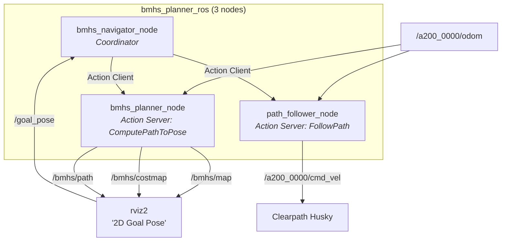

# BMHS ROS2 Package — Walkthrough

## What Was Built

The entire BMHS (Bidirectional Multi-Heuristic Search) path planner has been ported from a Python/C++ standalone project into a native **ROS2 Humble C++ package** (`bmhs_planner_ros`) with a professional action-based architecture.

---

## Architecture



| Node | Role | Action Interface |
|------|------|-----------------|
| `bmhs_planner_node` | Loads map, publishes OccupancyGrid/costmap, runs BMHS planner | `nav2_msgs/action/ComputePathToPose` (server) |
| `path_follower_node` | Pure-pursuit controller, drives the robot | `nav2_msgs/action/FollowPath` (server) |
| `bmhs_navigator_node` | Orchestrator — receives rviz2 goals, chains plan→follow | Action client for both |

> [!TIP]
> **Benchmarking-ready**: To test another planner algorithm, just write a new node that serves `ComputePathToPose` on `/bmhs/compute_path`. The navigator and follower work unchanged.

---

## File Structure

```
bmhs_planner_ros/
├── CMakeLists.txt                     # ament_cmake, 3 executables + shared lib
├── package.xml                        # GPL-3.0 licensed
├── include/bmhs_planner_ros/
│   ├── map_processor.hpp              # PGM loading, inflation, OccupancyGrid conversion
│   ├── vehicle_kinematics.hpp         # State/GridKey structs, motion primitives
│   ├── dijkstra.hpp                   # 2D Dijkstra with clearance penalty
│   ├── bmhs_planner.hpp               # Bidirectional multi-heuristic A*
│   └── path_smoother.hpp              # Simplification + Bezier smoothing
├── src/
│   ├── map_processor.cpp              # OpenCV map processing
│   ├── vehicle_kinematics.cpp         # Differential + ackermann primitives
│   ├── dijkstra.cpp                   # Parallel dual Dijkstra (std::thread)
│   ├── bmhs_planner.cpp               # Full BMHS search + path reconstruction
│   ├── path_smoother.cpp              # Bresenham LOS + quadratic Bezier
│   ├── bmhs_planner_node.cpp          # ROS2 action server node
│   ├── path_follower_node.cpp         # Pure-pursuit ROS2 action server
│   └── bmhs_navigator_node.cpp        # Coordinator ROS2 node
├── launch/
│   └── bmhs_planner.launch.py         # All 3 nodes + rviz2
├── config/
│   ├── bmhs_params.yaml               # Husky A200 defaults
│   └── rviz_config.rviz               # Pre-configured with map/costmap/path
└── maps/
    ├── map_proj.pgm                   # Default map (607×1006)
    ├── map.pgm                        # Alternative map (273×418)
    └── map.yaml                       # Map metadata
```

---

## Key Design Decisions

### Core Algorithm Library (No ROS Dependency)
The 5 core files ([map_processor](file:///home/kage/path_planning_and_smoothing/bmhs_planner_ros/src/map_processor.cpp), [vehicle_kinematics](file:///home/kage/path_planning_and_smoothing/bmhs_planner_ros/src/vehicle_kinematics.cpp), [dijkstra](file:///home/kage/path_planning_and_smoothing/bmhs_planner_ros/src/dijkstra.cpp), [bmhs_planner](file:///home/kage/path_planning_and_smoothing/bmhs_planner_ros/src/bmhs_planner.cpp), [path_smoother](file:///home/kage/path_planning_and_smoothing/bmhs_planner_ros/src/path_smoother.cpp)) are compiled into a shared library `bmhs_core_lib` with **zero ROS dependencies**. They only depend on C++17 standard library + OpenCV. This means:
- The algorithm can be unit-tested independently
- It can be reused outside ROS2
- It matches the original Python implementation line-by-line

### Coordinate System Handling
- **PGM**: Row 0 = top of image (Y-down)
- **ROS2**: Row 0 = bottom of map (Y-up)
- The [planner node](file:///home/kage/path_planning_and_smoothing/bmhs_planner_ros/src/bmhs_planner_node.cpp) handles all conversions:
  - `world → pixel`: `px = (world_x - origin_x) / res`, `py = (H-1) - (world_y - origin_y) / res`
  - `pixel → world`: inverse of above

### nav2 Compatibility
Using `nav2_msgs/action/ComputePathToPose` and `nav2_msgs/action/FollowPath` means the nodes are compatible with the nav2 ecosystem. The `use_start` field in ComputePathToPose is honored — if false, the planner uses `/odom` (or map origin as fallback).

### Husky Namespace
All Husky-specific topics default to the `/a200_0000/` namespace and are configurable via:
- Launch arguments: `odom_topic:=/my_robot/odom cmd_vel_topic:=/my_robot/cmd_vel`
- Config file: [bmhs_params.yaml](file:///home/kage/path_planning_and_smoothing/bmhs_planner_ros/config/bmhs_params.yaml)

---

## How to Build

```bash
cd /home/kage/path_planning_and_smoothing
source /opt/ros/humble/setup.bash
colcon build --packages-select bmhs_planner_ros
source install/setup.bash
```

## How to Launch

```bash
# Default (uses map_proj.pgm, differential drive, Husky namespace)
ros2 launch bmhs_planner_ros bmhs_planner.launch.py

# With custom map and resolution
ros2 launch bmhs_planner_ros bmhs_planner.launch.py \
    map_path:=/path/to/your/map.pgm \
    map_resolution:=0.05

# With custom topics (no namespace)
ros2 launch bmhs_planner_ros bmhs_planner.launch.py \
    odom_topic:=/odom \
    cmd_vel_topic:=/cmd_vel
```

## How to Use
1. Launch the planner (launches rviz2 automatically)
2. In rviz2, you'll see the map and inflated costmap
3. Click **"2D Goal Pose"** on the toolbar → click and drag on the map
4. The planner computes a path → green path appears on the map
5. The follower sends `cmd_vel` to drive the Husky to the goal

## Useful Debug Commands
```bash
# Check all BMHS topics
ros2 topic list | grep bmhs

# Check action servers
ros2 action list

# Manually send a planning goal
ros2 action send_goal /bmhs/compute_path nav2_msgs/action/ComputePathToPose \
    "{goal: {pose: {position: {x: 5.0, y: 5.0}, orientation: {w: 1.0}}}, use_start: false}"

# Reload map at runtime
ros2 service call /bmhs/reload_map std_srvs/srv/Empty
```

---

## Build Verification

| Check | Result |
|-------|--------|
| `colcon build` | ✅ Clean (0 errors, 0 warnings) |
| `ros2 pkg list \| grep bmhs` | ✅ `bmhs_planner_ros` |
| Launch args | ✅ 7 configurable arguments |
| Installed binaries | ✅ `bmhs_planner_node`, `path_follower_node`, `bmhs_navigator_node` |
| Installed maps | ✅ `map_proj.pgm`, `map.pgm`, `map.yaml` |
| Installed config | ✅ `bmhs_params.yaml`, `rviz_config.rviz` |
